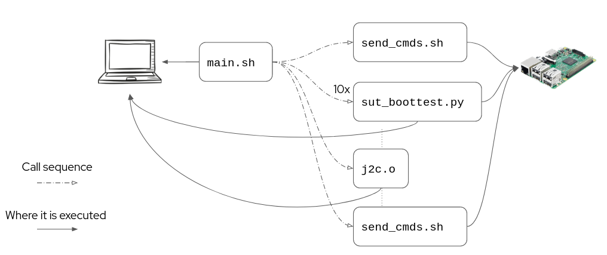

# Purpose
To have a tool that tests and reports on kernel boot-time, so far there are two main functionalities:

The first, is to test the effect of kernel patches on kernel boot-time. The example file 'patches.txt' lists a set of patches that were of interest to me. These patches are from  https://github.com/clearlinux-pkgs/linux. These patches were tested on the CentOS Automotive SIG's AutoSD [kernel](https://gitlab.com/CentOS/automotive/src/kernel/kernel-automotive-9). However, users can test any patchset and kernel they would like. As long as the dependencies and prerequisites are met.

The second, is to test the effect of kernel command-line parameters on the boot-time of the kernel. The example file 'commands.txt' lists parameters that are specifically targeting non-verbose booting. However, users can test any parameters they would like. As long as the dependencies and prerequisites are met.

## Structure
For function 1, each patch is applied on a system under test (SUT) via ssh. The local x86_64 machine (CONTROLLER), in my case, is running Linux fedora 5.19.4 and the SUT (RPi4) is running AutoSD. You can find the image [here](https://autosd.sig.centos.org/AutoSD-9/nightly/non-sample-images/).

For function 2, everything is the same besides that the script is testing kernel command-line parameters.

## Process
The following is how the tool handles function 1 (patch testing) and function 2 (kernel command-line parameter testing).

First off, there is a configuration script that is run at the beginning to help users set up their environment for either function 1 or 2.

For function 1 run:\
./main 0\
For function 2 run:\
./main 1

### Function 1 (patch testing)
The following is a visualization of the call and execution sequence for this function.

[LAPTOP PIC SRC](https://www.flaticon.com/free-icon/draw-laptop_81759) - [RPI PIC SRC](https://wiki.recalbox.com/en/hardware-compatibility/raspberry-pi)

- main.sh does the administritave work, configuration, function management, and graphing.
- patcher_main.sh manages the calls to the scripts that will run on the SUT.
- patcher_ssh.sh patches the SUT kernel, builds and installs the kernel, and sets it as the default kernel to boot.
- sut_boottest.py reboots the SUT and reports the boot-time using 'systemd-analyze', all is recorded to .json files in a temporary directory set by the user. This is run ten times.
- j2c.o converts the ten .json files generated by sut_boottest.py into one line in two .csv files. One file is for the average boot-time and the other is for the variance of the ten trials.
- patcher_rm_ssh.sh removes the previously build kernel from the SUT and sets the backup kernel (set by user) as the default boot kernel.
- run.gnuplot graphs all of the data in the .csv files.

NOTE: This script assumes that when you compile a kernel (on your remote host) the kernel boot entries will reside in /boot. Thus, you will have the following files/directories:
- /boot/vmlinuz\*$KERNELVERSION\*
- /boot/initramfs\*$KERNELVERSION\*
- /boot/System.map\*$KERNELVERSION\*
- /lib/modules/\*$KERNELVERSION\*

NOTE: If your remote host (system under test) is running Arch Linux, do not use this script. Arch Linux's .config file is not easily accessible and is not accounted for in this script.

#### Prerequisites
1. The CONTROLLER needs to have a file with the names of the patches of interest, one per line.
2. The CONTROLLER needs to have gnuplot installed.
3. The CONTROLLER needs to have SSH working properly.
3. Make sure that you have grubby installed on your SUT.
4. SUT needs to have a working kernel tree.
5. SUT needs to have a source repo for the patches of interest, names must match what is in the patch test file on the CONTROLLER.
6. SUT needs to have kernel boot entries in /boot and modules in /lib.
7. SUT needs to have SSH working properly.

### Function 2 (kernel command-line parameter testing)
The following is a visualization of the call and execution sequence for this function.

[LAPTOP PIC SRC](https://www.flaticon.com/free-icon/draw-laptop_81759) - [RPI PIC SRC](https://wiki.recalbox.com/en/hardware-compatibility/raspberry-pi)

- main.sh does the administritave work, configuration, function management, and graphing.
- send_cmds.sh sets and unsets the kernel command-line arguments.
- sut_boottest.py reboots the SUT and reports the boot-time using 'systemd-analyze', all is recorded to .json files in a temporary directory set by the user. This is run ten times.
- j2c.o converts the ten .json files generated by sut_boottest.py into one line in two .csv files. One file is for the average boot-time and the other is for the variance of the ten trial
s.
- run.gnuplot graphs all of the data in the .csv files.

#### Prerequisites
1. The CONTROLLER needs to have a file with the commands of interest, one per line.
2. The CONTROLLER needs to have gnuplot installed.
3. The CONTROLLER needs to have SSH working properly.
4. Make sure that you have grubby installed on your SUT.
5. SUT needs to have kernel boot entries in /boot
6. SUT needs to have SSH working properly.

## To Run
./main.sh \<cmd\>\
cmd == 0 -> test patching and kernel boot process\
cmd == 1 -> test only kernel command-line parameters

## Visualization
Specific data points' averages and variances are converted to csv format and plotted on a histogram.

### Data of Interest
Each patch gets time tested by running sut_boottest.py ten times, an average and variance is taken for each datapoint in the sample of ten trials, the average and variance points get recorded in .csv files and graphed on a histogram using gnuplot. The datapoints are generated from 'systemd-analyze' and 'systemd-analyze blame'. The points of interest are listed below.
1. kernel
2. initrd
3. userspace
4. total_boot_time
5. initrd_switch_root.service
6. NetworkManager-wait-online.service
7. NetworkManager.service
8. modprobe@drm.service
9. systemd-logind.service

### Graphs
You can find the histrograms for the averages in avg.png and the variances in var.png

#### To view them in the CLI, run:
$ gthumb <yourfile.png>
